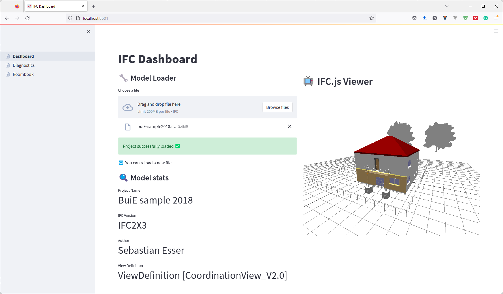

# TUM CMS Ifc Dashboard

A sample app built with IfcOpenShell, IfcJS, and Streamlit to explore IFC models.

## Installation

In order to run this repository, we assume Anaconda to be installed on your machine.

### Create new Anaconda environment

open Anaconda console

run `conda create --name buiE-projektarbeit`

### Activate newly created environment

run `conda activate buiE-projektarbeit`

### Ensure to have at least Python 3.10 installed in the environment

As of January 2023, the code has been successfully tested with Python 3.10 and 3.11

- get python version: `python --version`
- install python 3.10 (or 3.11 respectively): `conda install python=3.10`
- verify successful installation: run `python --version` once again

### Navigate to the project folder:

`cd path/to/Projektarbeit`

### Install required Dependencies

- Inside the anaconda console and the activated env, run the command `pip install -r requirements.txt`

## Run the application

Run the App with:

`streamlit run Dashboard.py`

# Frameworks

| Name                                                                               | License    |
|------------------------------------------------------------------------------------|------------|
| [IfcOpenShell](http://ifcopenshell.org/)                                           | LGPL-3.0   |
| [Ifc.js](https://ifcjs.io/)                                                        | MIT        |
| [Pandas](https://pandas.pydata.org/)                                               | BSD 3      |
| [Streamlit](https://streamlit.io/)                                                 | Apache 2.0 |
| [streamlit_tree_select](streamlit_tree_select)                                     | MIT        |
| Streamlit examples by [Yassine Oualid](https://github.com/myoualid/ifc-101-course) | MIT        |

# IFC sample models

The IFC models shipped in the `00_SampleModels` folder have been taken from the following repositories:

| Name                  | Github                                                                                                                                       | License   |
|-----------------------|----------------------------------------------------------------------------------------------------------------------------------------------|-----------|
| Duplex_A_20110907.ifc | [buildingSMART international sample-test-files](https://github.com/buildingSMART/Sample-Test-Files/tree/master/IFC%202x3/Duplex%20Apartment) | CC BY 4.0 |

The remaining models have been modeled by
the [Chair of Computational Modeling and Simulation](https://www.cee.ed.tum.de/cms/home/), Technical University of
Munich. 

